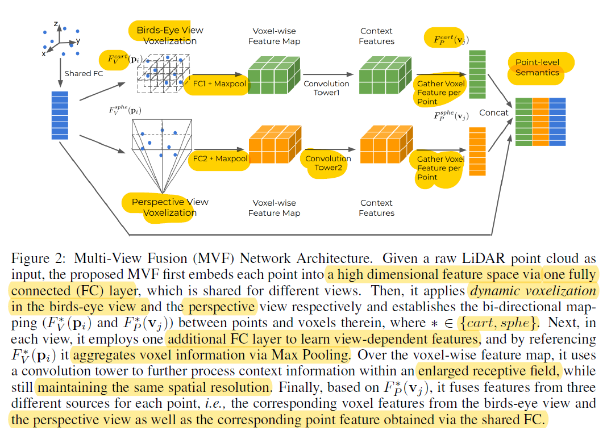

### Title
End-to-End Multi-View Fusion for 3D Object Detection in LiDAR Point Clouds

### Notes

* Synergize the BEV and perspective view
* The improvement of VoxelNet/SecondNet: change the hard voxelization to soft voxelizaiton.  
* Same loss function as Second and PointPillars.
* Has better performance than pointPillar and VoxelNet
